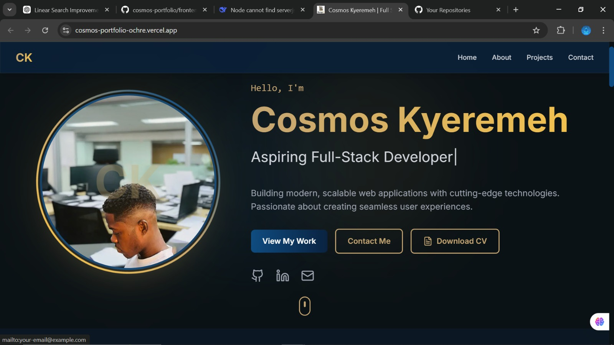
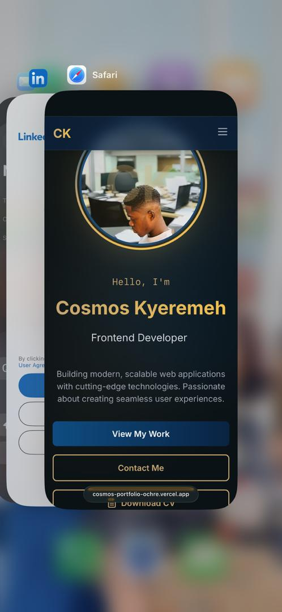

# 📄 Personal Portfolio – Full Stack Web Application

## 📸 Screenshots

### Desktop View


### Mobile View


---

A creative and futuristic full-stack personal portfolio website designed to showcase projects, skills, achievements, and professional journey while serving both recruitment and freelance purposes.

🌐 **Live Demo:** [View Portfolio](https://cosmos-portfolio-ochre.vercel.app/)

---

## 🚀 Project Overview

This portfolio is a modern web application built with a powerful frontend and backend architecture. It highlights technical expertise, featured projects, GitHub activity, and includes a fully functional admin dashboard for managing content.

The platform focuses on performance, interactivity, and clean UI inspired by a futuristic aesthetic.

---

## 🎯 Key Features

### 🌟 User-Facing Features

- **Animated hero banner** with typing introduction
- **Call-to-action buttons:**
  - View Projects
  - Contact Me
  - View CV
- **About section** with animated skill icons
- **Projects showcase** with cards and placeholders
- **GitHub stats & achievements** integration
- **Contact form** with EmailJS integration
- **Social media links** (GitHub, LinkedIn, Email)
- **Blog section** for future content

### 🛠 Admin Dashboard

- Secure admin authentication
- Add, edit, delete projects
- Manage blog posts
- View contact form submissions
- Update CV link and profile content

---

## 🧩 Tech Stack

### Frontend
- **Next.js 14** - React framework with App Router
- **TypeScript** - Type-safe development
- **Tailwind CSS** - Utility-first styling
- **Framer Motion** - Smooth animations
- **EmailJS** - Contact form handling

### Backend (Optional - Not deployed yet)
- **Node.js** - Express API
- **MongoDB Atlas** - Database
- **JWT** - Authentication

### Deployment
- **Vercel** - Frontend hosting
- **GitHub** - Version control

---

## 🎨 Design System

### Color Palette

| Color | Hex Code | Usage |
|-------|----------|-------|
| Rich Black | `#0B1215` | Primary background |
| Oxford Blue | `#0A2342` | Section surfaces |
| Yale Blue | `#0F4C81` | Accents & highlights |
| Satin Sheen Gold | `#C5A572` | Buttons & emphasis |
| Saffron | `#F2C14E` | CTA glow effects |

### Style Principles

- Futuristic layout
- Smooth micro-interactions
- Minimal but bold visuals
- Fully responsive design

---

## 📂 Project Structure

```
cosmos-portfolio/
├── frontend/
│   ├── src/
│   │   ├── app/              # Next.js app directory
│   │   ├── components/       # React components
│   │   └── data/             # Static data files
│   ├── public/               # Static assets
│   ├── .env.local           # Environment variables
│   └── package.json
├── backend/                  # Express API (optional)
│   ├── src/
│   │   ├── routes/
│   │   ├── controllers/
│   │   └── models/
│   └── package.json
├── docs/                     # Screenshots and documentation
└── README.md
```

---

## 📈 Goals

- Showcase professional development skills
- Attract recruiters and clients
- Centralize projects & achievements
- Provide scalable architecture for future growth

---

## 🔮 Future Enhancements

- [ ] Advanced animations and transitions
- [ ] Analytics dashboard integration
- [ ] Client testimonials section
- [ ] SEO improvements and meta tags
- [ ] Real-time notifications
- [ ] Blog with MDX support
- [ ] Backend deployment (MongoDB + Express)

---

## 🧪 Setup & Installation

### Prerequisites

- Node.js 18+ and npm
- Git

### Clone Repository

```bash
git clone https://github.com/CosmosKyeremeh/cosmos-portfolio.git
cd cosmos-portfolio
```

### Frontend Setup

```bash
cd frontend
npm install

# Create .env.local with your EmailJS credentials
# NEXT_PUBLIC_EMAILJS_SERVICE_ID=your_service_id
# NEXT_PUBLIC_EMAILJS_TEMPLATE_ID=your_template_id
# NEXT_PUBLIC_EMAILJS_PUBLIC_KEY=your_public_key

npm run dev
```

Visit http://localhost:3000

### Backend Setup (Optional)

```bash
cd backend
npm install

# Create .env with your MongoDB credentials
# MONGODB_URI=your_mongodb_connection_string
# JWT_SECRET=your_jwt_secret

npm start
```

---

## 🚀 Deployment

### Frontend (Vercel)

1. Push code to GitHub
2. Import repository on [Vercel](https://vercel.com)
3. Set **Root Directory** to `frontend`
4. Add environment variables (EmailJS credentials)
5. Deploy!

### Backend (Coming Soon)

Backend deployment guide will be added once MongoDB connection is configured.

---

## 📬 Contact

**Cosmos Kyeremeh**

- 📧 **Email:** kyeremehcosmos938@gmail.com
- 🔗 **GitHub:** [@CosmosKyeremeh](https://github.com/CosmosKyeremeh)
- 💼 **LinkedIn:** [cosmos-kyeremeh](https://www.linkedin.com/in/cosmos-kyeremeh-2b33882b3)
- 💬 **WhatsApp:** [+233 25 650 5747](https://wa.me/233256505747)

---

## 📄 License

This project is open-source and available under the **MIT License**.

---

## 🙏 Acknowledgments

- Design inspiration from modern portfolio websites
- Icons from [Lucide React](https://lucide.dev/)
- Animations powered by [Framer Motion](https://www.framer.com/motion/)

---

⭐ **Star this repo** if you found it helpful!

✨ **Built with ❤️ by Cosmos Kyeremeh**